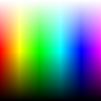
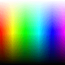

Imagequant Python - Python Bindings for libimagequant
=====================================================

|Github| |Discord| |PYPI Version| |Build Status| |Black| |License|

**Imagequant Python** are bindings to allow using libimagequant_ from Python.

**Libimagequant** is a small, portable C library for high-quality conversion of RGBA images to 8-bit indexed-color (palette) images.

.. _libimagequant: https://github.com/ImageOptim/libimagequant

Install
-------

From PyPI::

    pip3 install imagequant

NOTE: you may require compilation tools to build the library if you system is not suitable for the precompiled wheels. On Debian / Ubuntu you can install the build dependencies with the following command::

    sudo apt install build-essential python3-dev

Usage
-----

With PIL / Pillow
~~~~~~~~~~~~~~~~~

.. code-block:: python

    from PIL import Image
    import imagequant

    input_image = Image.open("./example.png")
    output_image = imagequant.quantize_pil_image(
        input_image,
        dithering_level=1.0,  # from 0.0 to 1.0
        max_colors=256,       # from 1 to 256
        min_quality=0,        # from 0 to 100
        max_quality=100,      # from 0 to 100
    )
    output_image.save("./out.png", format="PNG")

|input_image| → |output_image|

With Raw Data
~~~~~~~~~~~~~

.. code-block:: python

    import imagequant

    # 2×2px image
    IMAGE_DATA = (
        # | R | G | B | A |
        b"\xFF\x00\x00\xFF"  # red
        b"\x00\xFF\x00\xFF"  # lime
        b"\x00\x00\xFF\xFF"  # blue
        b"\xFF\xFF\xFF\xFF"  # white
    )

    output_image_data, output_palette = imagequant.quantize_raw_rgba_bytes(
        IMAGE_DATA,           # RGBA image data
        2, 2,                 # width, height
        dithering_level=1.0,  # from 0.0 to 1.0
        max_colors=256,       # from 1 to 256
        min_quality=0,        # from 0 to 100
        max_quality=100,      # from 0 to 100
    )

    # you can now encode image data and the palette in any image format...

Example ``output_image_data``:

.. code-block:: python

    b'\x02\x03\x00\x01'

Example ``output_palette``:

.. code-block:: python

    [0, 0, 255, 255, 255, 255, 255, 255, 255, 0, 0, 255, 0, 255, 0, 255, 0, 0, 0, 0, ...]
    # color 0      | color 1           | color 2       | color 3       | color 4   | ...

Development of the Bindings
---------------------------

Clone the repository and get the submodules::

    git clone https://github.com/wanadev/imagequant-python.git
    cd imagequant-python
    git submodule init
    git submodule update

Install some dependencies (preferably in a virtualenv)::

    pip3 install nox cffi pillow

Build the binary part of the lib::

    python imagequant/libimagequant_build.py

A ``.so`` file (or a ``.pyd`` file on Windows, or a ``.dylib`` file on MacOS) shoud now be present in the ``imagequant/`` folder. You will not need to run this command again until you change something in ``imagequant/libimagequant.h`` or in ``libimagequant/*.{c,h}``.

To check the coding style, you can run the lint with the following command::

    nox -s lint

To run the tests, use the following command::

    nox -s test

License
-------

**Imagequant Python** is licensed under the BSD 3 Clause. See the LICENSE_ file for more information.

**Libimagequant** is dual-licensed:

* For Free/Libre Open Source Software it's available under GPL v3 or later with additional copyright notices for older parts of the code.

* For use in closed-source software, AppStore distribution, and other non-GPL uses, you can obtain a commercial license.

Read its `license terms <https://github.com/ImageOptim/libimagequant#license>`_ for more information.

.. _LICENSE: https://github.com/wanadev/imagequant-python/blob/master/LICENSE

Changelog
---------

* **[NEXT]** (changes on ``master`` that have not been released yet):

  * Nothing yet ;)

* **v1.1.0:**

  * Added options to set minimal and target (maximal) quality (@injet-zhou, #4)

* **v1.0.5:**

  * Added Python 3.12 support (@flozz)
  * Removed Python 3.7 support (@flozz)

* **v1.0.4:**

  * Added Python 3.11 support

* **v1.0.3:**

  * ``arm64`` and ``universal2`` wheels for macOS M1
  * ``x86`` and ``x68_64`` wheels for musl-based Linux distro (Alpine,...)
  * ``x86`` wheels for Windows (``x86_64`` were already available)

* **v1.0.2:** Python 3.10 support and wheels
* **v1.0.1:** Fix encoding while reading the README in setup.py
* **v1.0.0:** Initial release with a minimal API.

.. |Github| image:: https://img.shields.io/github/stars/wanadev/imagequant-python?label=Github&logo=github
   :target: https://github.com/wanadev/imagequant-python
.. |Discord| image:: https://img.shields.io/badge/chat-Discord-8c9eff?logo=discord&logoColor=ffffff
   :target: https://discord.gg/BmUkEdMuFp
.. |PYPI Version| image:: https://img.shields.io/pypi/v/imagequant.svg
   :target: https://pypi.python.org/pypi/imagequant
.. |Build Status| image:: https://github.com/wanadev/imagequant-python/actions/workflows/python-ci.yml/badge.svg
   :target: https://github.com/wanadev/imagequant-python/actions
.. |Black| image:: https://img.shields.io/badge/code%20style-black-000000.svg
   :target: https://black.readthedocs.io/en/stable/
.. |License| image:: https://img.shields.io/pypi/l/imagequant.svg
   :target: https://github.com/wanadev/imagequant-python/blob/master/LICENSE
